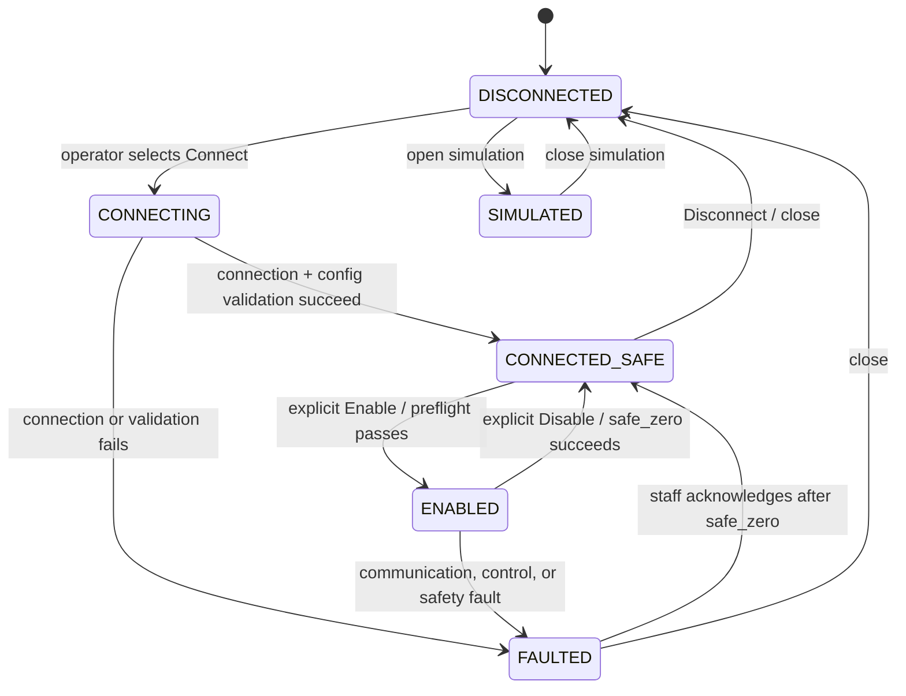

# LabJack Control System Safety, Lifecycle, and Migration Plan

**Status:** Proposed

**Applies to:** every production apparatus controlled by the BYU TIPICE LabJack Control application.

## Purpose and scope

This specification defines how the application connects to, enables, controls, disables, and shuts down network-connected apparatus. Its primary safety rule is simple:

> Whenever an apparatus is not explicitly enabled and healthy, every controllable output for that apparatus must be commanded to `0`.

The application is used by students and staff. Students operate approved production systems. Staff maintain systems, use diagnostics and simulation, and approve systems for release. Hardware mappings and calibrations are version-controlled configuration, not editable by ordinary operators.

This document does not replace physical emergency stops, relay interlocks, over-temperature cutoffs, pressure relief devices, or other independent engineering safeguards. Software must fail closed, but physical safety must not depend solely on the PC or network.

## Safety invariants

The following requirements apply to all production systems and must be enforced in shared code rather than duplicated in a system GUI.

1. **Output authorization.** Only the centralized hardware/safety service may issue a physical output write. GUI code, PID code, loggers, and system plugins request output values through that service.
2. **Safe default.** All configured digital and analog outputs have an explicit safe value. The default safe value is `0.0`; a different value requires a documented apparatus-specific justification and staff approval.
3. **Disabled means zero.** No PID, manual output, switch, or initialization write may reach hardware while the apparatus state is `DISCONNECTED`, `CONNECTED_SAFE`, `FAULTED`, `SHUTTING_DOWN`, or `SIMULATED`.
4. **Fail closed.** A hardware communication error, invalid configuration, invalid process input, unhandled control exception, shutdown request, or navigation away from an apparatus initiates `safe_zero()`.
5. **Safe sequencing.** `safe_zero()` writes all configured controllable outputs to their safe values while the connection is still open; only then is the device connection closed. Failures are recorded and surfaced to the operator.
6. **No automatic restart.** A fault never re-enables outputs. Recovery requires a staff-aware acknowledgement and a new explicit enable action.
7. **System isolation.** A system can command only registers declared in its validated configuration. Selecting, closing, or faulting one apparatus must not write channels belonging to another apparatus.
8. **Configuration validation.** Production systems cannot launch with placeholder values such as `TODO`, empty output pins, duplicate output assignments, unknown register types, missing safe values, or out-of-range output scaling.
9. **Simulation isolation.** Simulation uses a separate simulated transport and never opens or writes a physical LabJack handle. The UI displays a persistent, unambiguous simulation banner.
10. **Auditability.** Connection, enable, disable, fault, safe-zero, and output-command events are timestamped in an application event log. Data logs include application version, apparatus ID, configuration version, and simulation/real mode.
11. **Exclusive control lease.** A real apparatus has at most one active control session. The first authorized local station to connect holds a renewable lease; every other connection attempt is read-only or rejected until the holder disconnects, disables/releases the lease, or the lease expires after a verified loss of heartbeat.
12. **Local-presence authorization.** Real control may be enabled only from an approved station assigned to that apparatus's room and only while its local-presence check is valid. Network reachability to a LabJack is never, by itself, authority to control it.
13. **No remote control service.** The production web site and any browser interface must not expose an Internet- or campus-network-reachable endpoint that can issue hardware commands. A web page may launch a control client on the approved local station; the client retains all safety, lease, and presence enforcement.

## Apparatus lifecycle



### State definitions

| State | Permitted physical behavior | User-visible meaning |
| --- | --- | --- |
| `DISCONNECTED` | No hardware handle; no physical writes. | No apparatus is connected. |
| `CONNECTING` | Connection and read-only channel setup only. Outputs remain blocked. | Connecting and validating. |
| `CONNECTED_SAFE` | Reads permitted; all outputs remain safe/zero. | Connected, but not running. |
| `ENABLED` | Approved manual, PID, and switch outputs may be written. | Apparatus controls are active. |
| `FAULTED` | `safe_zero()` is attempted; all later outputs are blocked. | A fault occurred; staff acknowledgement required. |
| `SHUTTING_DOWN` | `safe_zero()` runs while connected, then the connection closes. | Closing safely. |
| `SIMULATED` | Simulated reads/writes only; never physical I/O. | Training/development mode. |

### Control ownership and local presence

Each real apparatus must have a control-ownership record maintained by the centralized safety service (or a small local control broker). The record includes apparatus ID, session ID, approved-station ID, authenticated operator when available, acquisition/renewal timestamps, and a heartbeat. Acquiring ownership is part of Connect, before a LabJack handle is opened. Ownership is released only after the common disable/`safe_zero()`/close sequence completes.

- A second client must never be allowed to take over an active apparatus merely because it knows the IP address. It receives the holder station, non-sensitive session status, and the permitted action (wait, request staff release, or use read-only monitoring if that is intentionally implemented).
- The lease must expire conservatively: loss of a client heartbeat first blocks further writes and attempts `safe_zero()`; only after the apparatus is confirmed safe may a new session acquire it. Staff override, if permitted, must be authenticated, logged, and require a visible confirmation that the current session will be stopped safely.
- The service must re-check both ownership and presence immediately before every physical output write; an expired lease or failed presence check is a fault/disable condition, not a warning.
- Initial deployment should use a per-room, managed control PC (or locked-down kiosk) with a unique station certificate/configuration and a network path limited to its assigned apparatus. Do not use browser IP address, Wi-Fi SSID, or GPS alone as proof that a user is in the room.
- If operation from portable computers is required later, choose a separately validated presence factor—such as a room-installed badge/NFC reader, a wired room token, or a managed-device certificate combined with a room gateway. The chosen mechanism must fail closed, have an offline behavior defined, and be tested for loss/replay/spoofing.

The system should distinguish **local control** from optional **read-only status viewing**. If remote monitoring is useful, it may publish sanitized telemetry and session status, but it cannot acquire a lease, satisfy presence, enable an apparatus, or write outputs.

### Website launch path (legacy Pale Moon replacement)

Retain the familiar lab portal as a catalog of apparatus. Each approved-room station can open a catalog link that launches the installed control interface for the selected apparatus. Two implementation options should be evaluated during the foundation phase:

| Option | User flow | Security characteristics |
| --- | --- | --- |
| Registered custom protocol (recommended) | Portal link such as `tipice-control://open?apparatus=hx-01` starts the installed client and selects the apparatus. | The browser does not receive a hardware-control API; the signed/managed client validates the apparatus ID, station assignment, lease, and presence. |
| Local loopback web UI | Portal link opens `http://127.0.0.1:<port>/...` served only by the local client. | Bind strictly to loopback, use an unguessable launch token, validate origin/CSRF protections, and keep all physical writes behind the same local safety service. |

The portal must provide only signed/allow-listed apparatus links, never a free-form IP or register selector. On a non-approved computer, the link should show an installation/room-use message or offer read-only documentation; it must not fall back to remote control. Browser compatibility should be tested with the lab's supported browser rather than depending on Pale Moon-specific behavior.

### Required lifecycle behavior

#### Connect

1. Validate the selected system configuration before opening a device.
2. Verify that the client is an approved station for the configured room and that the required local-presence check passes.
3. Acquire the apparatus's exclusive control lease; reject the connection if another active session holds it.
4. Open only the selected system's LabJack target.
5. Configure permitted input settings such as AIN range/resolution.
6. Build the complete configured output registry and call `safe_zero()` before declaring the connection usable.
7. Enter `CONNECTED_SAFE`. Enable buttons may become available; output controls remain visually disabled.

#### Enable

Before transition to `ENABLED`, require:

- a live connection and successful `safe_zero()` result;
- configuration validation success;
- required sensor values readable and within defined plausible bounds;
- apparatus-specific preflight/interlock checks;
- an explicit operator action (not an automatic transition after connection or fault recovery).
- a current control lease and successful local-presence check.

The enable action should be clearly labeled, require a confirmation for student-facing systems, and record who/what enabled the apparatus if authentication is later added.

#### Normal control

- The control scheduler runs only in `ENABLED`.
- Each control output is range checked and clamped to the configuration-defined physical voltage range before it reaches the hardware service.
- PID loops pause and write their safe output when their process value is invalid, stale, or fails an apparatus-specific interlock.
- Manual outputs must be validated on entry and only written after an approved user action or bounded update event.
- The controller uses one monotonic timing source for PID `dt`; it does not assume a fixed 500 ms interval.

#### Disable, navigation, and close

Disable, dashboard navigation, application close, and explicit disconnect all follow the same sequence:

1. Stop further controller scheduling and block new writes.
2. Stop data logging cleanly.
3. Call `safe_zero()` for every configured output and record each attempted result.
4. Reset UI control state and PID integrators.
5. Close the LabJack connection.
6. Release the control lease and record the release result.
7. Enter `DISCONNECTED`.

#### Fault handling

The following must transition the apparatus to `FAULTED`: repeated I/O failures, an output write failure, invalid PID input/tuning, configuration error discovered at runtime, an uncaught control callback exception, or a configured safety/interlock violation.

On a fault, the system blocks new commands, attempts `safe_zero()`, stops control and logging, displays the cause and safe-zero result, and writes an event log entry. A fault cannot be cleared automatically. Staff may acknowledge it only after reviewing the message and reconnecting or confirming the hardware state.

### `safe_zero()` contract

Every system must declare a complete `OutputDefinition` for every controllable register: key, register name, output type, allowed range, safe value, and optional dependency/order. `safe_zero()` uses this registry rather than inferring outputs from visible widgets.

```python
def safe_zero(reason: str) -> SafeZeroResult:
    """Block output commands, write every declared output to its safe value,
    verify writes when supported, and return per-channel results."""
```

It must be idempotent: invoking it repeatedly is safe. It must be called before closing a real connection. It must never be hidden behind a bare `except: pass`.

## Architecture responsibilities

| Layer | Responsibility | Must not do |
| --- | --- | --- |
| `core.hardware` | LabJack connection, named register I/O, simulation transport. | Know GUI widgets or apparatus layout. |
| `core.safety` | Lifecycle state machine, output gate, safe-zero, fault transition, event audit. | Contain apparatus-specific calibration equations. |
| `core.access` | Station authorization, local-presence validation, exclusive leases/heartbeats, signed launch requests. | Write hardware outputs or treat network location as physical presence. |
| `core.control` | Sensor polling, PID calculations, stale-data checks. | Write directly to LabJack. |
| `core.logging` | Thread-safe file/event logging. | Read or mutate Tk variables from a worker thread. |
| `systems.<name>.config` | Hardware map, calibrations, limits, interlocks, log schema, safe output registry. | Create widgets or open hardware connections. |
| `systems.<name>.view` | Equipment-specific GUI/P&ID and presentation. | Duplicate connect, disconnect, safe-zero, or PID scheduler behavior. |
| `development` | In-progress system definitions and views, defaulting to simulation. | Appear in the student production catalog. |

## Version and legacy preservation policy

Old GUIs are reference assets, not disposable source. Refactoring must never overwrite or delete an old implementation merely because a newer one supersedes it.

1. **Create an immutable baseline before migration.** Commit the current working tree only after reviewing its intended contents, tag it (for example, `legacy-baseline-2026-07`), and push the tag to GitHub.
2. **Retain source in the repository.** Keep existing historical implementations under `legacy/` (or retain the existing `Archive/` tree temporarily), organized by apparatus and revision. Do not import them from the production application.
3. **Document each snapshot.** Every legacy folder receives a short `README.md` identifying apparatus, approximate date, entry point, hardware assumptions, status, and the superseding production implementation.
4. **Use Git releases/tags for known-good versions.** Tag each lab deployment, such as `v1.0.0`, rather than relying on a branch tip. Staff can recover an exact deployed version with `git checkout <tag>` or a release package.
5. **Migrate by copy, not mutation.** Build new modules alongside legacy code. Once the replacement is accepted, mark the old version superseded but leave it intact.
6. **Do not commit transient files.** `__pycache__/`, `.pyc`, `.DS_Store`, generated logs, editor files, and local virtual environments are excluded by `.gitignore`. Hardware diagrams and selected reference images remain versioned.
7. **Avoid Git LFS until necessary.** Source, diagrams, and normal images can remain ordinary Git files. Use Git LFS only if large binary assets make cloning impractical.

## Migration plan

### Phase 0 — Preserve and inventory

**Goal:** establish a recoverable baseline without changing behavior.

1. Review the current dirty working tree; distinguish intended moves (such as the new `Archive/` tree) from generated files and accidental edits.
2. Add a root `.gitignore` and a root README that describes the current state without claiming it is production-ready.
3. Commit the current reference state on a dedicated branch and create/push the legacy baseline tag.
4. Add a legacy index identifying: Packed Columns versions, HX versions, Catalytic Methanation variants, standalone Pump Cart, Non-Newtonian GUI, test notebooks, diagrams, and active entry points.
5. Record a hardware inventory for every currently connected system: LabJack IP, serial number if available, I/O map, safe output values, calibration source/date, and responsible staff member.
6. Record each apparatus's physical room, approved control station(s), network segment, intended remote-monitoring policy, and the candidate local-presence mechanism.

**Exit criteria:** all current versions have a permanent Git commit and tag; no historical GUI is at risk of being lost during refactoring.

### Phase 1 — Establish the deployable project foundation

**Goal:** make the production code identifiable, installable, and testable.

1. Introduce a Python package under `src/` while retaining a small launcher for lab computers.
2. Add `pyproject.toml` with Python version and dependencies such as `labjack-ljm` and Pillow.
3. Add `.gitignore`, formatting/lint configuration, a minimal test command, and a CI workflow that runs without LabJack hardware.
4. Move the active code into clear `core`, `systems`, `assets`, `docs`, `tests`, and `legacy` boundaries incrementally—not in a single destructive move.
5. Provide a single production catalog and a separate staff-only development catalog.
6. Prototype the portal-to-client launch path on one lab control PC. Compare registered custom protocol and loopback UI against the lab browser/PC-management constraints; document the chosen approach and its threat model.

**Exit criteria:** a clean clone can install dependencies and launch simulation mode using documented commands.

### Phase 2 — Build the safety and lifecycle core

**Goal:** eliminate duplicate safety-critical behavior.

1. Implement the lifecycle state machine and output registry.
2. Make every real write flow through the output gate; remove direct `daq.write()` calls from GUI classes and PID loops.
3. Implement `safe_zero()`, structured fault handling, event logging, and a single shutdown path.
4. Add a simulator capable of deterministic sensor values and recorded output commands.
5. Implement station authorization, exclusive control lease/heartbeat, and the local-presence interface with a fail-closed default. Ensure every physical write checks the active lease and presence result.
6. Add automated tests for all permitted and forbidden state transitions, zeroing on close/fault, no writes while disabled, system isolation, lease contention/expiry, and presence loss.
7. Bench-test the safe-zero routine and lease-loss/presence-loss behavior for each apparatus with staff present before using the refactored system on a live experiment.

**Exit criteria:** every output is declared and can be demonstrated to reach zero after disable, disconnect, fault, close, and navigation.

### Phase 3 — Port existing production systems one at a time

**Goal:** preserve familiar operator interfaces while adopting the common lifecycle.

Suggested order: Shell & Tube HX, Packed Columns, then Catalytic Methanation. The order may change based on staff availability and current lab use.

For each system:

1. Copy its current active configuration/view into a new production module; leave the existing version unchanged as legacy/reference.
2. Convert channel mappings, calibration functions, limits, interlocks, and safe values into the validated configuration model.
3. Adapt its GUI to call the shared controller rather than duplicating connection/power/PID logic.
4. Test in simulation, then with an unpowered/isolated LabJack, then with staff on the live apparatus.
5. Compare readings, controls, logs, and normal shutdown behavior against the reference GUI.
6. Write the student operator guide and staff maintenance/checklist for that apparatus.
7. Tag a release only after the system passes its promotion checklist.

**Exit criteria:** migrated systems behave equivalently for intended experiments, with the centralized safety rules enforced.

### Phase 4 — Development systems and new apparatus

**Goal:** make the next ten systems predictable to add without exposing unfinished work to students.

1. Create a `development/<system>/` template containing configuration, controller adapter, view, assets, tests, and a system README.
2. Default every development system to simulation. Real hardware requires an explicit staff-only development flag and its own confirmed IP address.
3. Port Pump Cart and Non-Newtonian through this path. Preserve their current source as legacy/reference until the replacement is accepted.
4. Create a system-promotion checklist: hardware map verified, all outputs safely zeroed, calibrations reviewed, interlocks tested, simulation tests pass, real-hardware bench test complete, logs verified, and documentation approved.
5. Promote only by changing a reviewed manifest/status from `development` to `production`; do not copy code into a second location.

**Exit criteria:** a new apparatus can be scaffolded without copying core code, and unfinished systems cannot be accidentally selected by students.

### Phase 5 — Lab deployment and release management

**Goal:** make each lab PC reproducible and supportable.

1. Deploy only signed-off Git tags/releases, never an arbitrary development branch.
2. Use one documented installer/update script that creates a local virtual environment, installs the pinned package, and creates a desktop launcher.
3. Store data logs outside the source checkout in a documented per-computer data directory.
4. Display the application version, configuration version, selected apparatus IP, and real/simulated status in the GUI.
5. Enroll each lab PC as an approved station, deploy its station credential/configuration securely, and verify it cannot control an apparatus assigned to another room.
6. Publish the approved portal links and room-PC instructions. Test the link from an approved station, an unapproved campus PC, and an off-campus/untrusted network.
7. Maintain a rollback instruction: select the previous release tag/package, verify simulation startup, then return the lab PC to service.

**Exit criteria:** staff can install, update, validate, and roll back a lab computer using a documented process.

## Test and acceptance matrix

| Test | Required outcome |
| --- | --- |
| Start application | No physical connection or output write occurs. |
| Connect | Configuration validates; all declared outputs are zeroed; state becomes `CONNECTED_SAFE`. |
| Enable | Requires explicit action and preflight success. |
| Disable | All outputs are zeroed before controls are disabled. |
| Close/navigate away | Scheduler stops, logging stops, outputs zero, then LabJack closes. |
| Network/DAQ fault | State becomes `FAULTED`; safe-zero is attempted; no auto-restart. |
| Invalid input/calibration | Output remains blocked and fault is visible/logged. |
| Simulation | No real device handle or physical write is possible. |
| New system config | Validation rejects placeholders, undeclared outputs, duplicate channels, and missing safe values. |
| Second control client | A second computer cannot acquire an active apparatus or issue outputs; the current holder remains identifiable in the audit log. |
| Lease heartbeat loss | Writes are blocked and `safe_zero()` is attempted before another client can acquire the apparatus. |
| Presence loss | Enable/control is denied or disabled promptly; the event is logged and cannot be bypassed by network access alone. |
| Wrong-room station | A managed station cannot connect to or control an apparatus outside its configured room. |
| Portal launch | An approved portal link launches/selects only its allow-listed local apparatus; the same link on an unapproved computer offers no control path. |
| Remote monitoring (if enabled) | Telemetry is read-only and cannot acquire a lease, enable an apparatus, or write outputs. |
| Legacy recovery | A staff member can locate and run/reference the tagged legacy source without relying on uncommitted files. |

## Open implementation decisions

The following should be resolved before implementation begins:

- The desired staff authentication method for development mode and fault acknowledgement (local password initially, institutional login later, or another approach).
- Apparatus-specific preflight/interlock rules and which sensor ranges qualify as plausible for each system.
- The physical safe output order for systems with valves, heaters, pumps, or gas flows that require sequencing beyond writing all channels to zero.
- The retention location and backup policy for experimental CSV data and application event logs.
- Which current GUI revision is the preferred functional reference for each apparatus.
- Whether access should be limited to fixed managed room PCs initially (recommended), and whether remote read-only monitoring is desired.
- The room-presence factor to adopt if portable-device control is later required, including its failure and staff-override policy.
- Whether the portal launch path should use a registered custom protocol (recommended) or a loopback web UI after testing with the managed lab browser environment.
